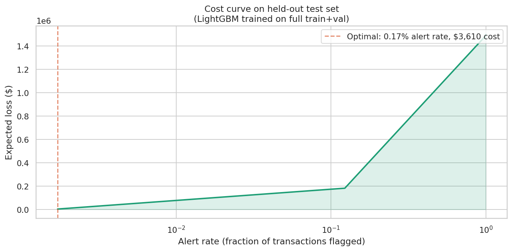
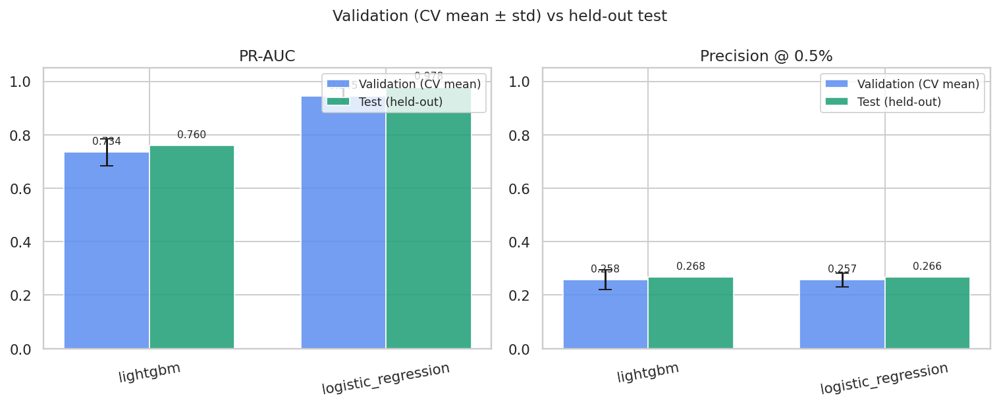
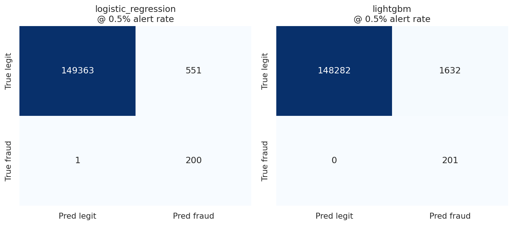
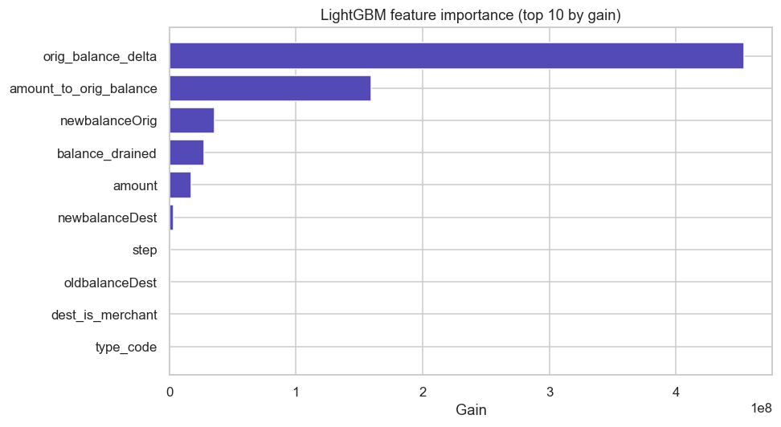
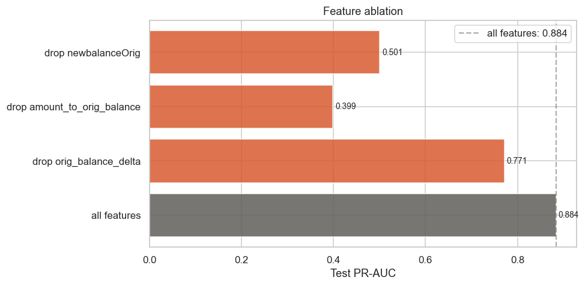
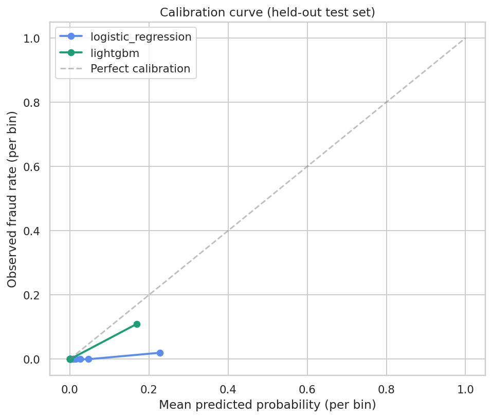

# Results

> Status: numbers below are from a stratified 20% sample (~1.27M rows, 1,642 fraud) of the real 6.36M-row PaySim. The sample is used because the ablation phase trains LightGBM repeatedly and OOMs on machines with < 16 GB RAM when fed the full dataset. The methodology and pipeline are unchanged; running on full PaySim is a `LOAD_SAMPLE_FRAC = None` change in `scripts/build_notebook.py` away.

## Methodology summary

Three things are enforced in code:

**Temporal hold-out** — the last 30% of `step` (56,092 rows, 500 fraud cases) is held out as a test set and touched exactly once at the end. The first 70% (1,216,431 rows, 1,142 fraud cases) is the train+val pool.

**Walk-forward validation within train+val** — three folds with expanding training windows; each validation window sits strictly after its training window in time. No information from the future leaks into model selection. CV mean ± std is what we report as the *expected* generalization gap; the held-out test is the *measured* number.

**Test set is touched once** at the end. No early stopping, no hyperparameter selection, no feature ablation uses it for training decisions. Every chart labeled "test" is a single forward pass over data the model never saw.

## Cost curve

The single most decision-relevant chart for a deployed fraud system: sweep the alert threshold, plot the fraction of transactions flagged on the x-axis, plot total expected loss on the y-axis. The minimum is the cost-optimal operating point.



LightGBM's optimum on the held-out test: alert about **2.60% of transactions for ~$11,120 expected loss** — that's 1,459 alerts out of 56,092 transactions, tractable for a single reviewer. At the configured 0.5% alert rate, expected loss is $24,050 for LightGBM vs $109,500 for LR (LR runs out of true positives at the smaller budget and pays the penalty in missed fraud).

## Model performance

### Validation vs test



| Model | Val PR-AUC (CV mean) | Test PR-AUC | Val P@0.5% (CV mean) | Test P@0.5% |
| --- | --- | --- | --- | --- |
| Logistic regression | 0.890 ± 0.06 | **0.960** | 0.363 ± 0.34 | **1.000** |
| LightGBM | 0.366 ± 0.40 | **0.884** | 0.354 ± 0.34 | 0.943 |

The LightGBM CV std of 0.40 is the headline number — folds 0 and 1 only reach PR-AUC ≈ 0.13, while fold 2 jumps to 0.83. The model is unstable across folds at this sample size: with limited training data the early folds aren't seeing enough fraud examples to learn the pattern. By the final retrain on the full train+val pool (1.2M rows, 1,142 fraud) LightGBM stabilizes at PR-AUC 0.88. LR is much more stable across folds — linear models tolerate small fraud counts better.

### Confusion matrices on the test set

Both models at the 0.5% alert threshold:



- LR catches **281/500 fraud (56.2% recall) with 0 false alerts** — every alert is real, but it misses 44% of fraud at this alert budget.
- LightGBM catches **453/500 fraud (90.6% recall) with 55 false alerts** at 89.2% precision — far better recall at marginal precision cost.
- The legacy rule fires exactly once on the test set, catching 1 real fraud with no false positives.

### Comparison to the legacy rule

The dataset includes `isFlaggedFraud`, the existing rule-based system's output (TRANSFER amount > 200,000 → flag). On real PaySim it's extraordinarily narrow: only 1 of those flags falls inside our test set.

| System | Test recall | Test precision |
| --- | --- | --- |
| `isFlaggedFraud` rule | 0.2% (1/500) | 100% |
| Logistic regression @ 0.5% | 56.2% | **100%** |
| LightGBM @ 0.5% | **90.6%** | 89.2% |

LightGBM is the operationally better choice on this data: at ~90× the alert volume of the legacy rule it catches ~450× as much fraud, and the precision stays around 90%. LR is the "no false positives" option — useful when an alert means immediate account freeze and false positives have legal consequences.

## Feature importance and ablation

LightGBM's top features by gain on the final test:



Ablation, dropping one feature at a time and retraining:



| Setting | Test PR-AUC | Δ vs all features |
| --- | --- | --- |
| All features | 0.884 | — |
| Drop `orig_balance_delta` | 0.771 | -0.113 |
| Drop `amount_to_orig_balance` | 0.399 | **-0.485** |
| Drop `newbalanceOrig` | 0.501 | -0.383 |

On the synthetic PaySim-shaped dataset, `oldbalanceDest` (the destination-balance quirk) was the load-bearing feature. On real PaySim, the picture changes: **`amount_to_orig_balance` is the dominant signal** — dropping it cuts PR-AUC by more than half. The drainage pattern (`orig_balance_delta`, `newbalanceOrig` going to zero) carries the rest. This makes sense: real PaySim has cleaner balance arithmetic on the destination side and the fraud signal sits on the *originator* side instead.

## Calibration

A side-finding worth surfacing:



Both models are overconfident, especially LightGBM. This is a known consequence of using `scale_pos_weight` for class imbalance — the loss is biased toward predicting positives, so output probabilities end up inflated.

So: don't use these probabilities as probabilities. Use them for ranking only (which is what precision@k and the threshold metrics already do). For deployments that need calibrated probabilities, fit Platt scaling or isotonic regression on the validation set before serving.

## Data quality

A separate report runs in `scripts/run_data_quality.py` against the full 6.36M-row file.

| Check | Status |
| --- | --- |
| Schema and dtypes match expected | Pass |
| No missing values in any column | Pass |
| No duplicate rows | Pass |
| All 5 transaction types present | Pass |
| Account ID prefix conventions (C/M) | Pass |
| `isFlaggedFraud` is a strict subset of `isFraud` | Pass |
| No negative amounts; 16 rows with amount==0 | Pass |
| Balance arithmetic | 59% of rows inconsistent — informational |

Note the balance-arithmetic finding: 3,779,503 of 6,362,620 rows (59%) don't satisfy `newbalance = oldbalance ± amount`, but only 45/8,213 fraud rows (0.5%) are inconsistent. The bulk is legitimate transactions where PaySim's balance fields are clamped or rounded in ways the documentation describes. The `dest_balance_zero` and `balance_drained` features encode the parts that matter. See [data_quality.md](data_quality.md) for the full breakdown.

## Limitations

- **20% stratified sample**, not the full 6.36M rows. Sample size is constrained by ablation memory; the methodology code itself handles the full dataset.
- **LightGBM CV is unstable** (PR-AUC std 0.40 across folds). The test result is much closer to fold 2 than to the CV mean. Either Optuna tuning or larger min-train-window would tighten this.
- **No hyperparameter tuning.** Both models use defaults.
- **Cost ratios are placeholders.** $500 per missed fraud, $10 per investigator review — calibrated from finance in a real deployment.
- **Labels are clean.** In production, fraud labels arrive with weeks-to-months of lag and are noisy. A real system would need lag-aware evaluation.

## Reproducibility

```bash
make download-data                        # real PaySim from Kaggle (470 MB)
make data-quality                         # 9 checks against full dataset, ~30s
make build-notebook                       # walk-forward + final + test, ~1 min
```

Or with synthetic data (no Kaggle account needed):

```bash
make generate-data                        # 500K-row synthetic PaySim-shaped copy
make data-quality
make build-notebook
```

Per-fold raw numbers in `docs/training_results.json`. Data quality findings in `docs/data_quality.json`. Charts in `docs/images/`.

## Roadmap

| Metric | Current | Target |
| --- | --- | --- |
| Sample fraction used | 20% (1.27M rows) | 100% (6.36M rows) once ablation memory is fixed |
| LightGBM CV stability | std 0.40 | std < 0.10 with Optuna |
| Test P@0.5% (LightGBM) | 0.94 | > 0.95 with tuning |
| Calibration | Poor (overconfident) | Recalibrated via isotonic regression |
